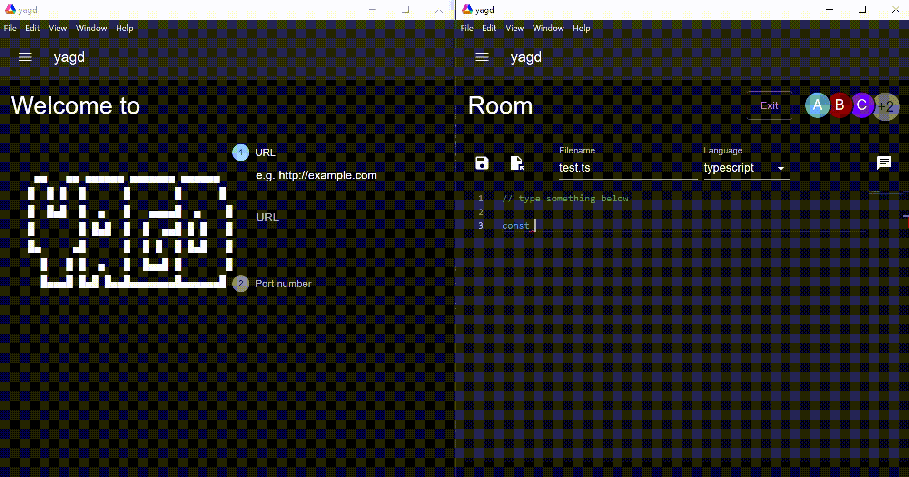

# yagd

* [Website](https://dalaman.github.io/yagd/)

## Requirements

-   _Node_ v16.15.0

-   _OpenJDK_ v11.0

    ### Dev only

    -   _Make_

    -   _clang-format_

    -   _Yarn_

## Setup

1.  Init & update submodule by `git submodule init && git submodule update`

2.  Setup [submodule](https://github.com/dalaman/yagd-client)

## うさげ

1.  Launch server by `make`

2.  Start client

    1.  `cd client/yagd-client`

    2.  `yarn dev`
